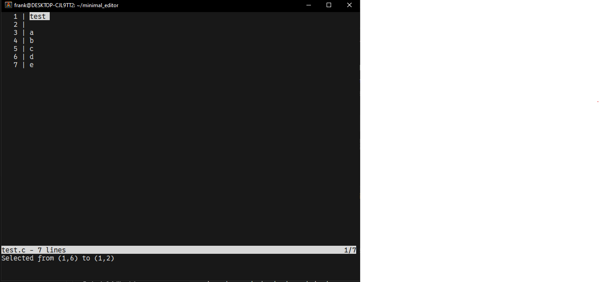

# cupid - A Minimalist Text Editor for Linux

**cupid** is a lightweight, FOSS (Free and Open Source Software) text editor designed for GNU/Linux systems. Built with simplicity in mind, it provides essential editing capabilities while maintaining a tiny codebase written in pure C. Ideal for quick edits or terminal-based workflows.

  

## Features

- **Minimalist Design**: Barebones implementation with <500 lines of C code.
- **Keyboard Navigation**:
  - Arrow keys for movement
  - Shift+Arrow keys for text selection
- **Clipboard Integration**:  
  `Ctrl+C` copies selection using OSC 52 terminal protocol
- **File Operations**:
  - `Ctrl+S` to save
  - Open files via command line argument
- **Editing Basics**:
  - Insert/delete characters
  - Split/merge lines
  - Tab support (4 spaces)
- **Visual Feedback**:
  - Line numbers
  - Inverse highlighting for selections
  - Status bar with file info
  - Message bar with help/notifications

## Installation

### Requirements
- GNU/Linux environment
- C compiler (gcc)
- Terminal with OSC 52 support (most modern terminals)

### Build from Source
```bash
git clone https://github.com/yourusername/cupid.git
cd cupid
make
sudo cp cupid /usr/local/bin/  # Optional: install system-wide
```

## Usage

```bash
cupid [filename]  # Open existing file or create new
```

### Key Bindings
| Key Combination       | Action                          |
|-----------------------|---------------------------------|
| `Ctrl + Q`            | Quit                           |
| `Ctrl + S`            | Save file                      |
| `Ctrl + C`            | Copy selection to clipboard    |
| `Shift + Arrows`      | Select text                    |
| `Backspace`           | Delete previous character      |
| `Delete`              | Delete next character          |
| `Tab`                 | Insert 4 spaces                |
| `Enter`               | Insert new line                |

## Known Limitations

- **Basic Functionality**: Intentionally lacks advanced features like:
  - Syntax highlighting
  - Search/replace
  - Multiple buffers
- **Clipboard Dependency**: Requires terminal OSC 52 support
- **Line Length**: No line wrapping for long lines
- **File Size**: Optimized for small-to-medium files

## Contributing

Contributions are welcome! Please follow these guidelines:
1. Fork the repository
2. Create a feature branch (`git checkout -b improve-feature`)
3. Commit changes
4. Push to branch
5. Open a Pull Request

## License

Released under [GNU GPLv3](LICENSE)  
